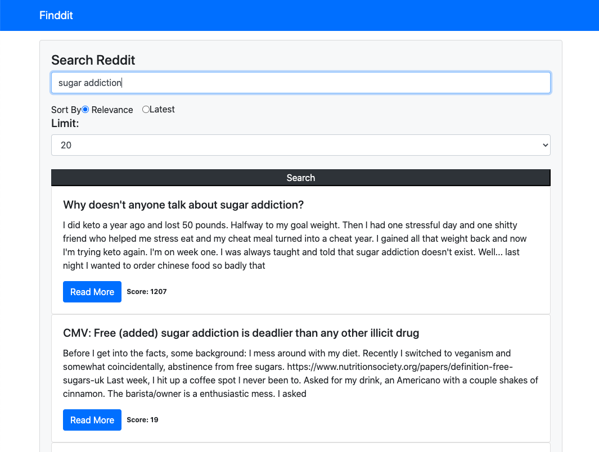

## Reddit search API

### PROTOTYPE
Using reddit public API to retrieve related reddits' title and body.

### Running
* clone this repo
* npm init, install dependencies
* npm start
* go to local host

### Search Reddit
[View Live here](https://xinyutang-redditsearch.herokuapp.com/)

### In-app Screens

